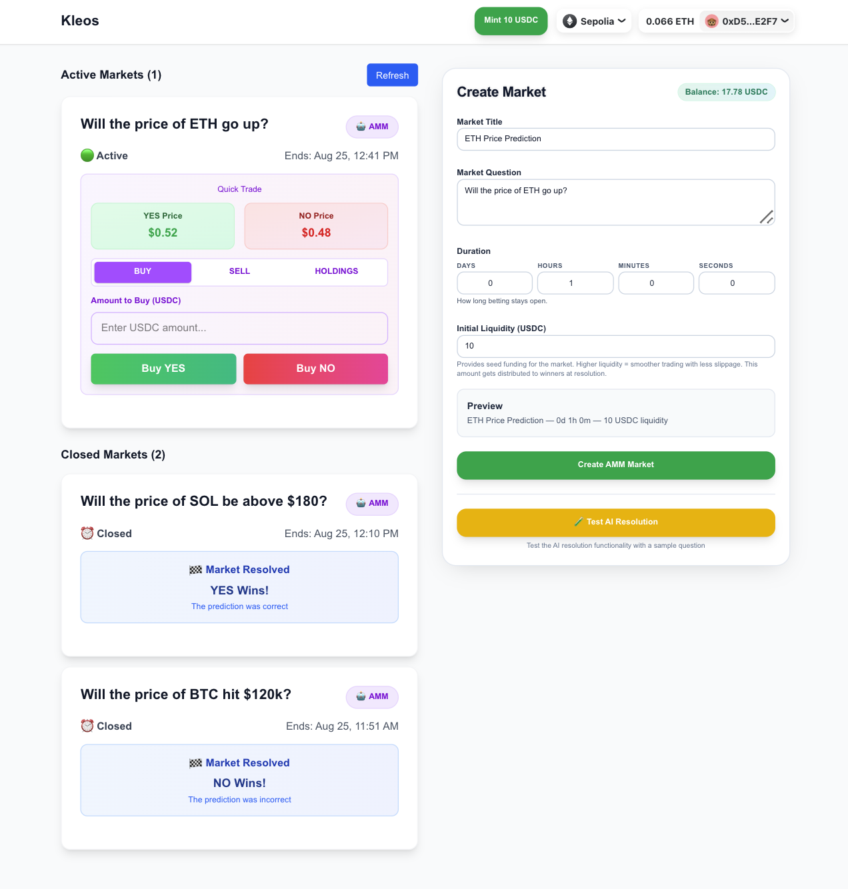
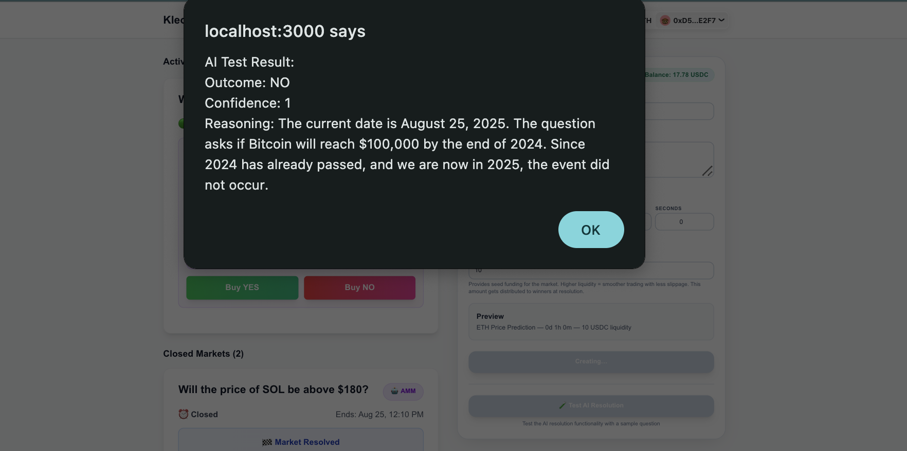
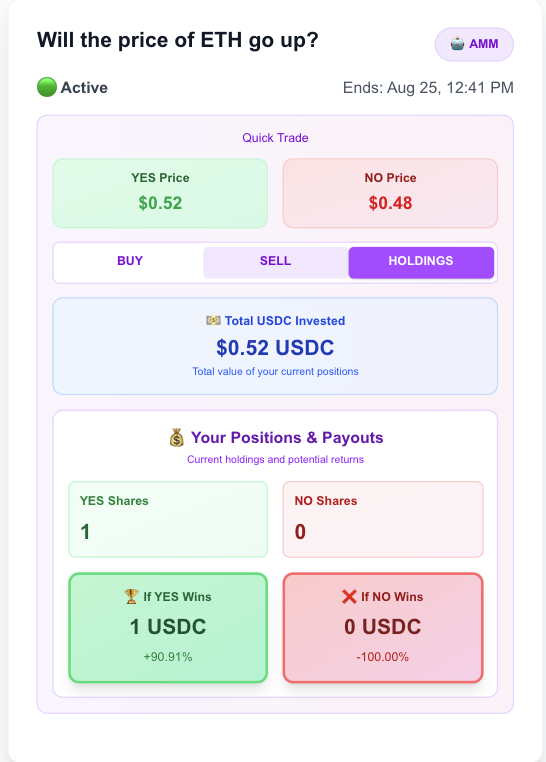
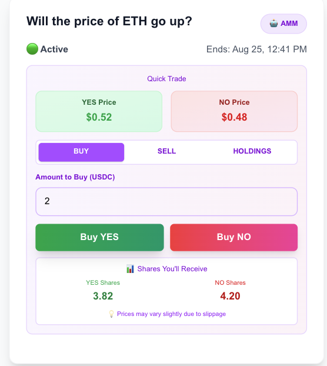

# Kleos — AMM Prediction Markets (Sepolia)

Polymarket‑style prediction markets using a Constant Product AMM with AI‑powered resolution.

**🏆 3rd Place Flare Bounty @ ETHGlobal New York 2024**

This is the simplified, iterated branch focused on AMM-style markets with AI resolution. The original hackathon submission (v0 branch) included P2P challenges and on-chain price feed resolution via Flare Network's FTSO.

## What did I learn

This was a very fun project that's very much unfinished and untested. I learned a ton about AMM theory, how Polymarket works (LP incentives, market resolution, multiple markets), and got hands-on with web3 basics, Solidity, and Wagmi.

I'm forcing myself to stop tweaking because the point isn't perfection—it's about funneling curiosity and having fun building something completely foreign to me. Still have so much to explore with AMM papers and the math behind it all. Excited to dive deeper and find the next thing to build!

## What it does TLDR

- Create markets with initial USDC liquidity
- Trade YES/NO shares via CP‑AMM
- Resolve with AI (server‑side) and claim payouts

## UI Showcase

|               Main Interface               |               AI Resolution Test               |               Trading Interface               |               Holdings & Payouts               |
| :----------------------------------------: | :--------------------------------------------: | :-------------------------------------------: | :--------------------------------------------: |
|  |  |  |  |

## Deployed Addresses (Sepolia)

- Market Factory: `0x5064978caBAEDaBa10e3DAf00846937b97E0B220`
- MockUSDC: `0x443002A432DCc022206500cde2a9c5247BA12EAf`

## Quick Start

```bash
# Frontend
cd frontend
npm install
npm run dev   # http://localhost:3000

# Contracts
cd ../contracts
forge build
```

## Env (.env.local in frontend)

```env
NEXT_PUBLIC_CHAIN_ID=11155111
NEXT_PUBLIC_RPC_URL=https://eth-sepolia.g.alchemy.com/v2/YOUR_API_KEY
GOOGLE_GEMINI_API_KEY=your_gemini_api_key_here
```

## How to use

1. Connect wallet → Mint Mock USDC → Approve infinite spending for Market Factory
2. Create market (title, question, duration, initial liquidity)
3. Approve infinite spending for individual markets → Trade YES/NO shares (USDC)
4. After end time → Resolve with AI → Winners claim

## API (AI Resolution)

- POST `/api/ai-resolve`
  - Body: `{ question: string, marketAddress?: string, endTime?: number }`
  - Returns: `{ outcome: "YES"|"NO", confidence: number, reasoning: string, success: boolean }`

## Contracts (Core)

- Factory: `createMarket()`, `getAllMarkets()`
- Market: `buyYes()`, `buyNo()`, `sellYes()`, `sellNo()`, `resolve()`, `claim()`, `meta()`
